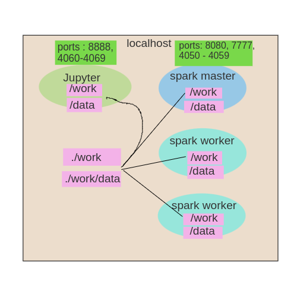
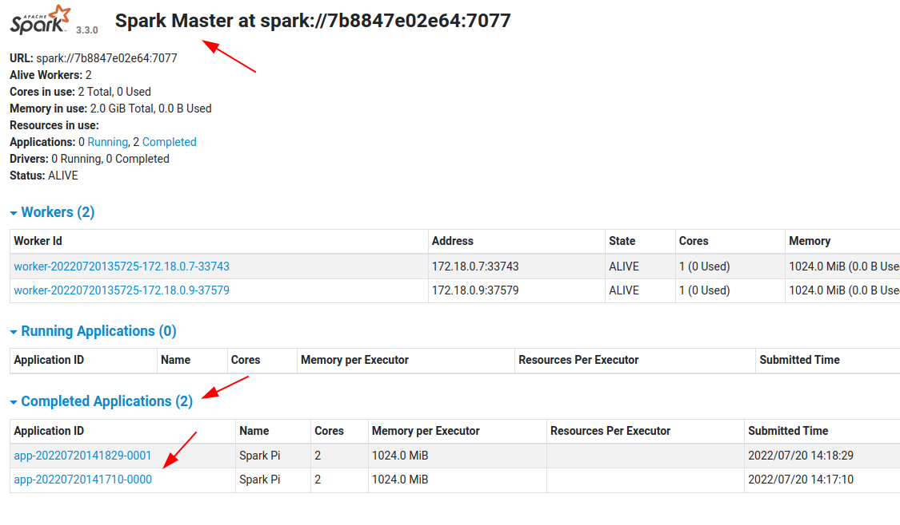

# Running a Spark Cluster Using Docker

## About

This project runs multiple [Spark](https://spark.apache.org/) workers on a single machine using Docker and docker-compose.

What it does:

- Spin up Spark master + multiple workers effortlessly, on a single machine
- Have a full Spark dev environment locally, with Java, Scala and Python (Jupyter)
- No need install any JDK, Python or Jupyter on local machine.  Every thing runs as Docker containers
- Only thing needed is Docker and docker-compose

I have adopted the really awesome [bitnami/spark](https://hub.docker.com/r/bitnami/spark/) Docker and expanded on it.  Here is [Bitnami Spark Docker github](https://github.com/bitnami/bitnami-docker-spark)

## First Steps

Please install [Docker](https://www.docker.com/) and [docker-compose](https://docs.docker.com/compose/)

## Quick Start

```bash
$   git clone https://github.com/elephantscale/spark-in-docker
$   cd spark-in-docker

$   bash ./start-spark.sh # this will start spark cluster

$   docker-compose ps # to see docker containers
```

You will see startup logs

Try these URLs:

- Spark master at port number 8080 (e.g. localhost:8080)

That's it!

## Setup Explained

The [docker-compose.yaml](https://github.com/elephantscale/spark-in-docker) is the one sets up the whole thing.  I adopted this from [Bitnami's docker-compose](https://raw.githubusercontent.com/bitnami/bitnami-docker-spark/master/docker-compose.yml)

My additions:

- mounting  current directory as `/workspace/` in spark docker containers.  Here is where all code would be
- mounting `./data` directory as `/data/` in containers.  All data would be here
- Ports `4050-4059` are mapped for Spark UI on Spark master

**Note about port numbers**

- For Spark.app.ui ports running on spark master, add +10.  So Spark-master:4040 is localhost:4050
- For Spark.app.ui ports, add +20.  So jupyter:4040 is localhost:4060

Here is a little graphic explaining the setup:



## Running Multiple Workers

By default we start 1 master + 2 workers.

To Start 1 master + 3 workers, supply the number of worker instances to the script

```bash
$    bash ./start-spark.sh 3
```

Checkout Spark-master UI at port 8080 (e.g. localhost:8080) .  You will see 3 workers.

Login to spark master

```bash
$   docker-compose exec spark-master  bash
```

## Testing the Setup

Login to spark master

```bash
# on docker host

$   cd spark-in-docker
$   docker-compose exec spark-master  bash
```

Within Spark-master container

```bash
# within spark-master container

$   echo $SPARK_HOME
# output: /opt/bitnami/spark
```

### Run a Spark Application (Run on Spark-Master)

Run Spark-Pi example:

```bash
# within spark-master container

# run spark Pi example
$   $SPARK_HOME/bin/spark-submit \
        --master spark://spark-master:7077 \
        --num-executors 2  \
        --class org.apache.spark.examples.SparkPi \
        $SPARK_HOME/examples/jars/spark-examples_*.jar \
        100
```

Should get answer like

```console
Pi is roughly 3.141634511416345
```

Check master UI (8080).  You will see applications being run!



### Spark Shell (Scala) (Run on Spark-Master)

Execute the following in spark-master container

```bash
$   spark-shell  --master  spark://spark-master:7077
```

Now try to access the UI at [http:.//localhost:4050](http:.//localhost:4050)  

**Note** : This port is remapped to `4050`  

Within Spark-shell UI:

```scala
> val a = spark.read.textFile("/etc/hosts")

> a.count 
// res0: Long = 7 

> a.show
// you will see contents of /etc/hosts file

// Let's read a json file
val b = spark.read.json("/data/clickstream/clickstream.json")
b.printSchema
b.count
b.show
```

### PySpark (Run on Spark-Master)

Execute the following in spark-master container

```bash
$   pyspark    --master  spark://spark-master:7077
```

In pyspark

```python
a = spark.read.text("/etc/hosts")
a.count()
a.show()

# Let's read a json file from /data directory
b = spark.read.json('/data/clickstream/clickstream.json')
b.printSchema()
b.count()
b.show()
```

## Developing Applications

For this we have a **spark-dev** environment that has all the necessities installed.

See [spark-dev/README.md](spark-dev/README.md) for more details.

### Sample Applications

See here for some sample applications to get you started:

- [Scala app](sample-app-scala/)  and [instructions to run it](sample-app-scala/README.md)
- [Java app](sample-app-java/) and [instructions to run it it](sample-java-app/README.md)
- [Python app](sample-app-python/) and [instructions to run it](sample-app-python/README.md)

## Troubleshooting

To troubleshoot connection issue, try busybocx

```bash
$   docker  run  -it --rm --user $(id -u):$(id -g)  --network bobafett-net  busybox
```

And from within busybox, to test connectivity

```bash
$   ping  spark-master

$   telnet spark-master  7077
# Press Ctrl + ] to exit
```


## Happy Sparking!