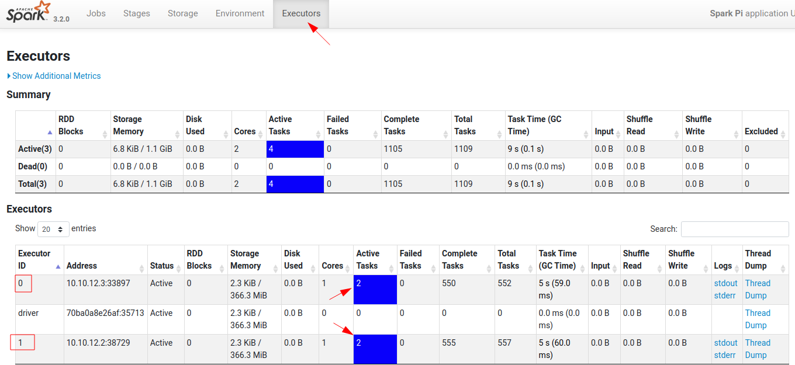

# Running a Spark Cluster Multiple Workers Using Docker

## About

This project runs multiple [Spark](https://spark.apache.org/) workers on a single machine using Docker and docker-compose.

What it does:

- Have a full Spark dev environment locally
- Spin up Spark master + multiple workers + Jupyter notebook effortlessly, on a single machine
- No need install any JDK, Python or Jupyter on local machine.  Every thing runs as Docker containers
- Only thing needed is Docker and docker-compose

I have adopted the really awesome [bitnami/spark](https://hub.docker.com/r/bitnami/spark/) Docker and expanded on it.  Here is [Bitnami Spark Docker github](https://github.com/bitnami/bitnami-docker-spark)

## First Steps

Please install [Docker](https://www.docker.com/) and [docker-compose](https://docs.docker.com/compose/)

## Quick Start

```bash
$   git clone https://github.com/elephantscale/spark-in-docker
$   cd spark-in-docker

$   bash ./start-all.sh # this will start all containers and print out Jupyter url

$   docker-compose ps # to see docker containers
```

You will see startup logs

Try these URLs:

- Spark master at [http://localhost:8080](http://localhost:8080)
- Jupyter notebook UI url will be printed out on terminal.  It will be in this format `http://127.0.0.1:8888/lab?token=xxxxxxxxxxxxxxx`.  Just copy paste the URL in browser

That's it!

## Setup Explained

The [docker-compose.yaml](https://github.com/elephantscale/spark-in-docker) is the one sets up the whole thing.  I adopted this from [Bitnami's docker-compose](https://raw.githubusercontent.com/bitnami/bitnami-docker-spark/master/docker-compose.yml)

My additions:

- mounting  `./work` directory as `/work/` in spark docker containers.  Here is where all code would be
- mounting `./work/data` directory as `/data/` in containers.  All data would be here
- PySpark Jupyter notebook is setup to work with Spark
- Ports `8888` is mapped for Jpyter
- Ports `4050-4059` are mapped for Spark UI on Spark master
- Ports `4060-4069` are mapped for Spark UI on Jupyter notebook

**Note about port numbers**

- For Spark.app.ui ports running on spark master, add +10.  So Spark-master:4040 is localhost:4050
- For Spark.app.ui ports running on  jupyter, add +20.  So jupyter:4040 is localhost:4060

Here is a little graphic explaining the setup:


## Run Spark Applications

Login to spark master

```bash
$   docker-compose exec spark-master  bash
```

Within Spark-master container

```bash
$   echo $SPARK_HOME
# output: /opt/bitnami/spark
```

### Spark Shell (Run on Spark-Master)

Execute the following in spark-master container

```bash
$   spark-shell  --master  spark://spark-master:7077
```

Now try to access the UI at [http:.//localhost:4050](http:.//localhost:4050)  

**Note** : This port is remapped to `4050`  

Within Spark-shell UI:

```scala
> val a = spark.read.textFile("/etc/hosts")

> a.count 
// res0: Long = 7 

> a.show
// you will see contents of /etc/hosts file

// Let's read a json file
val b = spark.read.json("/data/clickstream/clickstream.json")
b.printSchema
b.count
b.show
```

### PySpark (Run on Spark-Master)

Execute the following in spark-master container

```bash
$   pyspark    --master  spark://spark-master:7077
```

In pyspark

```python
a = spark.read.text("/etc/hosts")
a.count()
a.show()

# Let's read a json file from /data directory
b = spark.read.json('/data/clickstream/clickstream.json')
b.printSchema()
b.count()
b.show()
```

### Run a Spark Application

Run Spark-Pi example:

```bash
# run spark Pi example
$   $SPARK_HOME/bin/spark-submit --master spark://spark-master:7077 --num-executors 2  \
--class org.apache.spark.examples.SparkPi $SPARK_HOME/examples/jars/spark-examples_*.jar 1000
```

Should get answer like

```console
Pi is roughly 3.141634511416345
```

Check master UI (8080).  Click on application .. should see 2 executors running on both workers.



### Reading some large data (on Spark-master)

**Note:**

The `./data` directory is mapped to `/data`

We need to make sure this directory has write permissions from docker contaier.  Do this on **host machine** to fix permissions

```bash
# on host machine
$   sudo chmod -R 777 work/data
```

Execute the following on Spark-master docker container

```bash
$   cd /data/clickstream
$   python   gen-clickstream-json.py 
$   ls -lh  json
```

This will generate about 1G of json files.

```bash
$   pyspark  --master  spark://spark-master:7077   --num-executors 2
```

Access the UI : http:.//localhost:4050  (or the port number printed)

In pyspark

```python
clickstream = spark.read.json("/data/clickstream/json/")
# check 4040 UI

clickstream.printSchema()
clickstream.show()
clickstream.count()
clickstream.filter("action = 'clicked'").count()
```

Check the UI


## Running Multiple Workers

Start 1 master + 3 workers

```bash
$   bash ./start-all 3
```

Checkout Spark-master UI at [http://localhost:8080](http://localhost:8080) .  You will see 3 workers.

Login to spark master

```bash
$   docker-compose exec spark-master  bash
```

## Fix Shared Directory Permissions

The `./work` directory is mounted as `/work` directory in docker containers.  It needs to be writable by Spark and Jupyter containers.  Here is how to fix permissions

Run the following on host machine

```bash
$   sudo chown -R $(id -u):$(id -g) ./work
$   sudo chmod -R 777 ./work  
```

## Using Jupyter Notebook

When you start containers by `bash ./start-all.sh` script, it will print out the Jupyter URL.  Copy paste the URL in browser.

Go into the `work` directory.

You will see `work/sample-app-python/hello-world.ipynb` file.  Open it and `run-all`.

The notebook code is setup to work with Spark cluster.

Observe Spark-UI at [http://localhost:4060](http://localhost:4060)

## Running Sample Applications

There are multiple apps in `work` directory

- [Scala app](work/sample-app-scala/)  and [instructions to run it](work/sample-app-scala/README.md)
- [Java app](work/sample-app-java/) and [instructions to run it it](work/sample-java-app/README.md)
- [Python app](work/sample-app-python/) and [instructions to run it](work/sample-app-python/README.md)

## Happy Sparking!