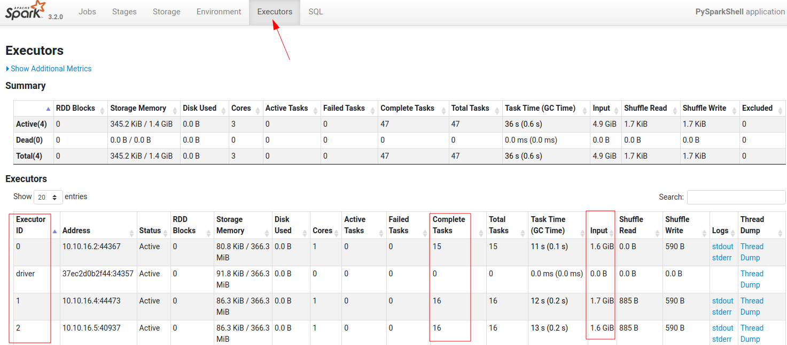

# Spark Dev Environment with Jupyter + PySpark + Scala + Java

This docker extends [Jupyter Pyspark docker image](https://hub.docker.com/r/jupyter/pyspark-notebook).  It has the following

* Jupyter lab (installed)
* JDK 17  (installed)
* Scala 2.13  (added)
* SBT 1.6.2 (added)
* Maven 3.8.6 (added)
* Spark-3.3.0-scala-2.12 version as the default spark.  The original notebook has spark-3.3.0-scala-2.13  as default.

You can find this on dockerhub [elephantscale/spark-dev](https://hub.docker.com/repository/docker/elephantscale/spark-dev)

## Using it

Get this image

```bash
$   docker  pull elephantscale/spark-dev
```

### Running it

Use the handy script [run-spark-dev.sh](run-spark-dev.sh)

Here is the script:

```bash
export CURRENT_USER="${CURRENT_USER-$(id -u):$(id -g)}"

# make maven build dir, if doesn't exist
mkdir -p  $HOME/.m2

docker run -it --rm \
    --user $CURRENT_USER \
    --network  bobafett-net \
    -v $HOME/.m2:/var/maven/.m2  \
    -v $HOME/.m2:/home/jovyan/.m2  \
    -v $(pwd):/workspace:z   \
    -w /workspace \
    -p 18888:8888 \
    elephantscale/spark-dev  $*
```

A few notes:

* the CURRENT_USER setting is important so files created within the container have the right permissions
* `~/.m2` maven directory is mounted within the container as `/home/jovyan/.m2`, so maven can reuse downloaded files.  This speeds up builds quite a bit
* The current directory is mounted as `~/workspace`
* And port mapping from localhost:18888 to container:8888

### CLI mode

```bash
$   ./run-spark-dev.sh   /bin/bash
```

### To start jupyter lab

```bash
$   ./run-spark-dev.sh
```

And go to the URL printed out on the console.

## Quick Start on Spark

Start the dev environment in CLI mode

```bash
$   ./run-spark-dev.sh  /bin/bash
```

Within container try this:

```bash
$   pyspark
```

Within pyspark shell try the following:

```python
> spark.range(1,10).show()
```

You will see output

```text
+---+
| id|
+---+
|  1|
|  2|
|  3|
|  4|
|  5|
|  6|
|  7|
|  8|
|  9|
+---+
```

### Running an Spark sample program

Run this from within the container:

```bash
$   spark-submit   --class org.apache.spark.examples.SparkPi \
                   $SPARK_HOME/examples/jars/spark-examples_*.jar \
                   100
```

To run on on spark cluster:

Make sure the spark-cluster is running.  You can use this script [../start-spark.sh](../start-spark.sh) script.  See [../README.md](../README.md) in the parent directory.

```bash
# this will start the spark cluster
$   ./start-spark.sh
```

Now from within spark-dev container:

```bash
$   spark-submit   --master spark://spark-master:7077   \
       --class org.apache.spark.examples.SparkPi \
       $SPARK_HOME/examples/jars/spark-examples_*.jar \
       100
```

### Reading some large data 

Start spark-dev container

```bash
$   cd  spark-in-docker
$   ./spark-dev/run-spark-dev.sh  /bin/bash
```

The `~/workspace` directory has the code and data

Execute the following in spark-dev container

```bash
$   cd ~/workspace/data/clickstream
$   python   gen-clickstream-json.py 
$   ls -lh  json
```

This will generate about 1G of json files.


First try to verify in local mode

```bash
$   cd ~/workspace
$   pyspark  
```

Access the UI : http:.//localhost:4050  (or the port number printed)

In pyspark

```python
clickstream = spark.read.json("data/clickstream/json/")
# check 4040 UI

clickstream.printSchema()
clickstream.show()
clickstream.count()
clickstream.filter("action = 'clicked'").count()
```

Now let's connect to spark-master

```bash
$   pyspark  --master  spark://spark-master:7077   --num-executors 2
```

Execute the following on pyspark shell

```python
clickstream = spark.read.json("/data/clickstream/json/")
# check 4040 UI

clickstream.printSchema()
clickstream.show()
clickstream.count()
clickstream.filter("action = 'clicked'").count()
```

Check the UI



## Using Jupyter Notebook

By default  `spark-dev` container starts a jupyter notebook

```bash
$   cd  spark-in-docker
$   ./spark-dev/run-spark-dev.sh 
```

Go to the URL printed on teh console


You will see  a sample application in `workspace/sample-app-python/hello-world.ipynb` file.  Open it and `run-all`.

The notebook code is setup to work with Spark cluster.

Observe Spark-UI at [http://localhost:4060](http://localhost:4060)

## Building (Devs Only)

```bash
$   docker build . -t elephantscale/spark-dev
$   docker build . -t elephantscale/spark-dev:1.0
```

Publishing to Dockerhub

```bash
$   docker login
$   docker push elephantscale/spark-dev:1.0
$   docker push elephantscale/spark-dev
```


